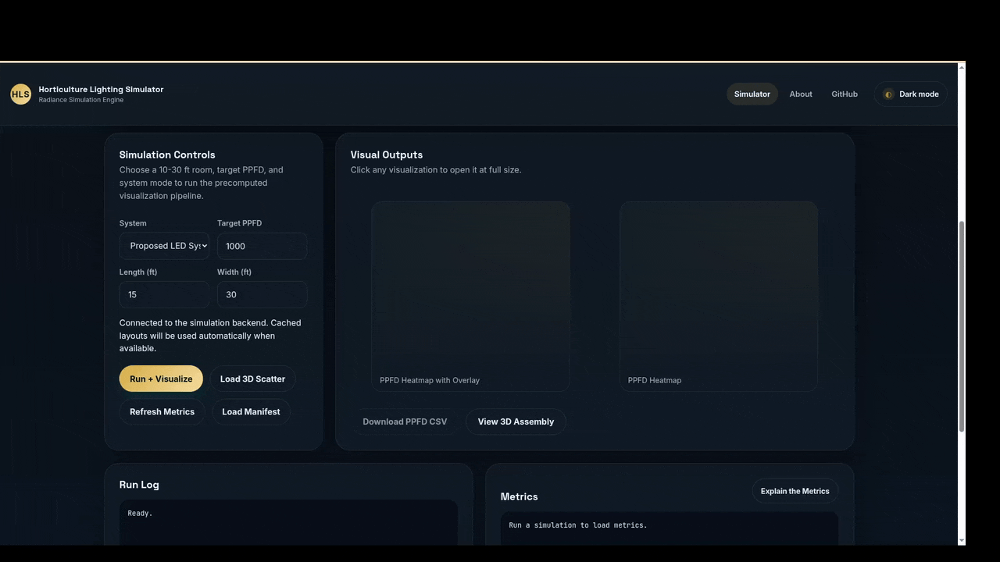
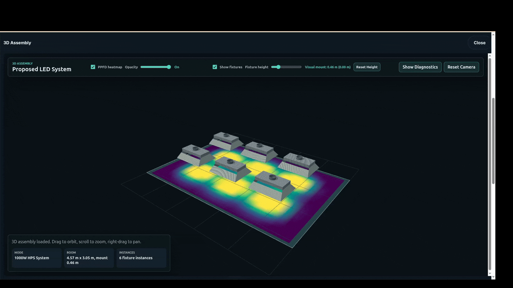
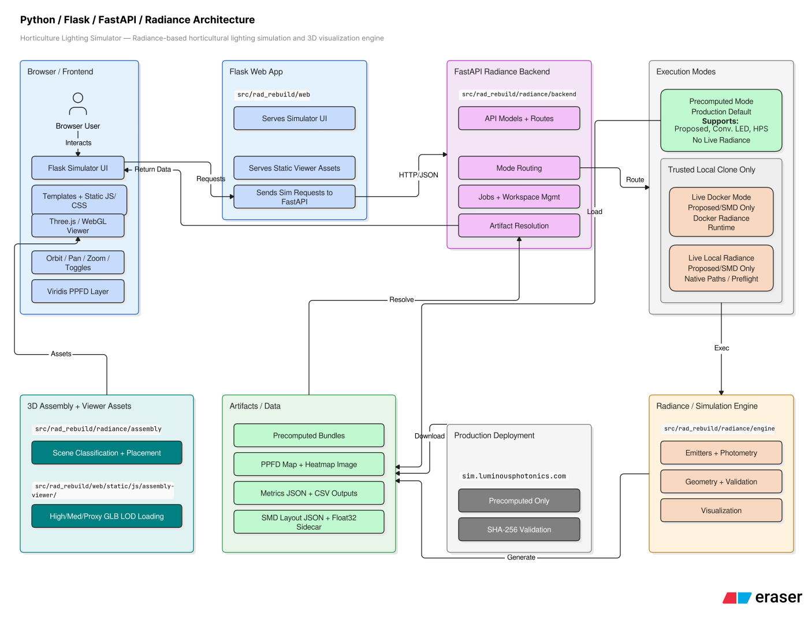
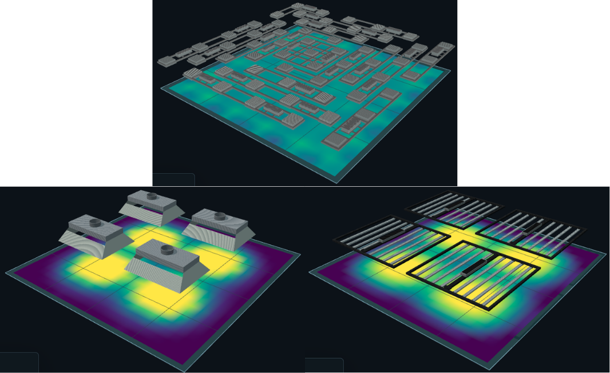
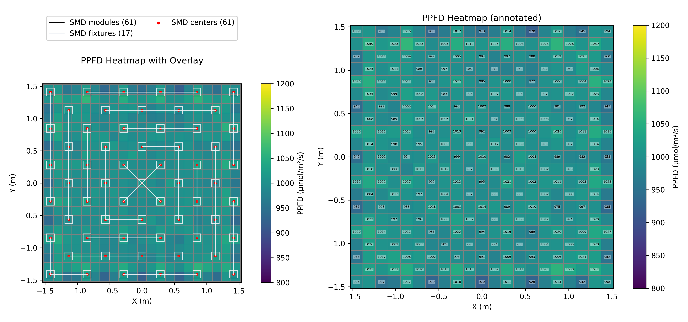

# Horticulture Lighting Simulator

A Radiance-based horticultural lighting simulation and 3D visualization engine.

<p align="center"> 
 
</p>

<p align="center">
  <strong>Python · Flask · FastAPI · Radiance · Three.js · Docker · Scientific Simulation</strong>
</p>

<p align="center">
  <a href="https://github.com/luminousphotonics/horticulture-lighting-simulator/actions/workflows/ci.yml"></a>
  
  
  
</p>

Horticulture Lighting Simulator is a public repository for comparing
horticultural lighting systems with Radiance-based optical simulation,
precomputed playback, and browser-based 3D visualization. The public project is
named `horticulture-lighting-simulator`; the internal Python package remains
`rad_rebuild`.

## Core Features

- Compare **Proposed LED System**, **Conventional LED System**, and **1000W HPS
  System** outputs.
- Run public precomputed playback locally.
- Optionally run trusted local live Radiance for the Proposed LED System through
  Docker or a local Radiance installation.
- Generate and inspect Radiance-based photosynthetic photon flux density (PPFD) artifacts: metrics, heatmaps, CSVs,
  manifests, layout JSON, and runtime metadata.
- Explore outputs in a browser-based 3D Assembly Viewer with an interactive
  Viridis PPFD layer.
- Use runtime preflight and setup guidance for trusted local live modes.

## Visual Overview

<p align="center"> 
 
</p>

<p align="center"> 
 
</p> 

<p align="center"> 
 
</p> 

<p align="center"> 
 
</p>

## 3D Assembly Viewer

The 3D Assembly Viewer is a Three.js/WebGL CAD-style viewer for inspecting the
simulated lighting layout in the browser. It supports the Proposed LED System,
Conventional LED System, and 1000W HPS System.

The Proposed LED viewer uses geometry-aware multi-asset placement from
`smd_layout.json["fixture_groups"]`. Conventional LED and HPS use single-fixture
placement. Viewer assets ship as optimized GLB LODs (`high`, `medium`, and
`proxy`) so the browser viewer stays lightweight while still presenting clean CAD
geometry.

Interactive controls include orbit, pan, zoom, fixture visibility toggles,
visual fixture-height offset, and reset camera. The PPFD layer is mapped to the
measurement plane with a Viridis texture, and its hover tooltip reads the
underlying Float32/grid PPFD values rather than sampling texture colors.

Static viewer assets are prepared with a compact CAD pipeline:

```text
build123d -> STEP -> GLB -> gltfpack high/medium/proxy LODs
```

## Modes And Public Repo Scope

- Public GitHub clone: precomputed mode works out of the box after install.
- Trusted local clone: optional live Docker/local Radiance is available for the
  Proposed LED System only.
- Conventional LED and 1000W HPS live modes are not included in the public repo
  because licensed IES assets are not distributed.
- Conventional LED and 1000W HPS remain available in precomputed mode.

This repository is not the official Radiance project. It is an application that
uses Radiance-based simulation workflows.

## Quick Start

### Clone And Install

```bash
git clone https://github.com/luminousphotonics/horticulture-lighting-simulator.git
cd horticulture-lighting-simulator
python3 -m venv .venv
source .venv/bin/activate
python -m pip install -e ".[dev]"
```

### Run Precomputed Local Demo

```bash
rad-rebuild-dev
```

Open the local URL printed in the terminal. Defaults are backend port `8786` and
web port `5001`.

Before console scripts are installed, run the same launcher as a module:

```bash
PYTHONPATH=src python -m rad_rebuild.dev
```

Custom ports are available for parallel local work:

```bash
rad-rebuild-dev --backend-port 8787 --web-port 5002
```

### Run Trusted Local Live Mode

Live mode is intended for trusted local clones:

```bash
rad-rebuild-dev --live
```

or:

```bash
PYTHONPATH=src python -m rad_rebuild.dev --live
```

Live Docker is the recommended live path for local Proposed LED runs. Live
Local Radiance is supported on Linux and macOS when Radiance paths are
configured; Windows local Radiance is not officially supported initially.

Example local Radiance setup:

```bash
export RADIANCE_BIN_DIR="$(dirname "$(command -v oconv)")"
export RADIANCE_HOME="$(dirname "$RADIANCE_BIN_DIR")"
export RADIANCE_LIB_DIR="$RADIANCE_HOME/lib"
rad-rebuild-dev --live
```

Temporary `export` commands affect only the current terminal and the dev server
started from it. They do not modify the user's system.

## Precomputed Bundles

The repository includes small public `10x10` demo bundles for all three systems
under `data/radiance/precomputed/`. Expanded public precomputed bundles can be
downloaded manually or through the provided bundle tooling when release assets
are available.

The downloader uses public HTTPS release assets, SHA-256 checks, staging
extraction, and archive path validation:

```bash
python scripts/radiance/download_precomputed.py --help
```

Private/licensed IES source files are not included in the public repository.

## Live Modes

Live execution modes are for trusted local clones only. The public live path is
limited to the Proposed LED System. Conventional LED and HPS use licensed source
photometry that is not distributed here, so those systems are public through
precomputed playback only.

Live Docker is preferred because it avoids a host Radiance installation. Live
Local Radiance requires valid Radiance paths on Linux or macOS:

```bash
export RADIANCE_HOME=/opt/radiance
export RADIANCE_BIN_DIR="$RADIANCE_HOME/bin"
export RADIANCE_LIB_DIR="$RADIANCE_HOME/lib"
rad-rebuild-dev --live
```

Restart the dev server after changing runtime environment variables.

## Exact Local Commands

Run Flask only:

```bash
PYTHONPATH=src python -m rad_rebuild.web.app
```

Run the FastAPI backend only:

```bash
PYTHONPATH=src python -m rad_rebuild.radiance.backend.server
```

Run tests:

```bash
PYTHONPATH=src python -m pytest -q tests
```

Run the durable local quality gate:

```bash
npm ci
PYTHONPATH=src python scripts/dev/baseline.py
npm run test:browser
git diff --check
```

Check generated dependency exports:

```bash
UV_CACHE_DIR=/tmp/rad_rebuild_uv_cache ./.venv/bin/uv lock --check
UV_CACHE_DIR=/tmp/rad_rebuild_uv_cache ./.venv/bin/uv export --frozen --format requirements.txt --extra web --extra api --extra scientific --no-dev --no-emit-project --output-file requirements.txt
UV_CACHE_DIR=/tmp/rad_rebuild_uv_cache ./.venv/bin/uv export --frozen --format requirements.txt --extra scientific --extra live-radiance --no-dev --no-emit-project --output-file docker/radiance/requirements.runtime.txt
git diff --exit-code -- requirements.txt docker/radiance/requirements.runtime.txt
```

## Repository Structure

```text
src/rad_rebuild/web/
  Flask app, templates, static browser assets, and simulator UI

src/rad_rebuild/radiance/backend/
  FastAPI models, routes, execution modes, jobs, workspace handling, and artifacts

src/rad_rebuild/radiance/assembly/
  3D assembly scene classification, placement, and coordinate transforms

src/rad_rebuild/radiance/engine/
  Simulation, emitters, photometry, geometry, validation, and visualization

src/rad_rebuild/web/static/js/assembly-viewer/
  Three.js/WebGL assembly viewer, LOD loading, controls, and PPFD layer logic

src/rad_rebuild/web/static/viewer/
  Optimized static GLB viewer assets for Proposed LED, Conventional LED, and HPS

scripts/radiance/
  Live Radiance helpers, precomputed bundle tooling, and reproducibility scripts

scripts/viewer/
  STEP inputs, STEP-to-GLB conversion, LOD generation, and asset validation

scripts/deploy/
  Production startup helpers

tests/radiance/
  Python tests for API, playback, runtime, scientific, viewer, and artifact contracts

tests/browser/
  Playwright smoke tests for browser UI and assembly viewer behavior

docs/engineering/
  Architecture, quality gates, security, scientific, and API contract notes

docs/deployment/
  Optional deployment documentation
```

## Testing Scope

CI runs Python tests across supported Python versions, a Python 3.12 durable
baseline, browser smoke tests, package smoke, dependency lock/export checks,
Radiance Docker smoke, whitespace checks, and scheduled dependency audits.

The test suite covers Python/Radiance contracts under `tests/radiance/`, browser
smoke under `tests/browser/`, API/OpenAPI/frontend type contract checks, viewer
asset validation, assembly viewer transforms, heatmap, fixture controls,
runtime/live preflight behavior, public route contracts, precomputed playback,
import boundaries, and runtime cleanup.

Public CI runs without private IES sources. Private photometry-dependent checks
are opt-in and skip unless the local private assets and explicit environment
flags are present.

## Architecture And Engineering Docs

- [Architecture baseline](docs/engineering/ARCHITECTURE_BASELINE.md)
- [Service topology ADR](docs/engineering/ADR-0001-radiance-service-topology.md)
- [API and artifact contracts](docs/engineering/API_AND_ARTIFACT_CONTRACTS.md)
- [Boundary security controls](docs/engineering/BOUNDARY_SECURITY.md)
- [Scientific change policy](docs/engineering/SCIENTIFIC_CHANGE_POLICY.md)
- [Quality gates](docs/engineering/QUALITY_GATES.md)
- [Radiance Docker runtime](docker/radiance/README.md)
- [Proposed LED surrogate notes](docs/radiance/our_led_surrogate.md)
- [Conventional LED IES notes](docs/radiance/conventional_led_ies.md)
- [HPS IES notes](docs/radiance/hps_ies.md)

## Limitations

- This is a public simulation and portfolio project, not a commercial lighting
  design platform.
- Live Radiance execution requires trusted local setup and is public-supported
  for Proposed LED/SMD only.
- The committed demo data is intentionally small. Expanded datasets belong in
  public release archives or local generated workspaces.
- Results depend on source assumptions, room geometry, mounting height, layout
  configuration, and Radiance/runtime settings.
- Real deployments require project-specific validation by qualified reviewers.

## Research Context

The Proposed LED System is connected to U.S. Patent No. 10,687,478, [“Optimized LED Lighting Array for Horticultural Applications”](https://patents.google.com/patent/US10687478B2/en), and to a solo-authored manuscript currently under peer review in *Lighting Research & Technology*.

## License

Licensed under the [Apache License 2.0](LICENSE).

## Citation

Citation metadata is available in [CITATION.cff](CITATION.cff).

## Author

Built by [Austin Rouse](https://github.com/luminousphotonics).